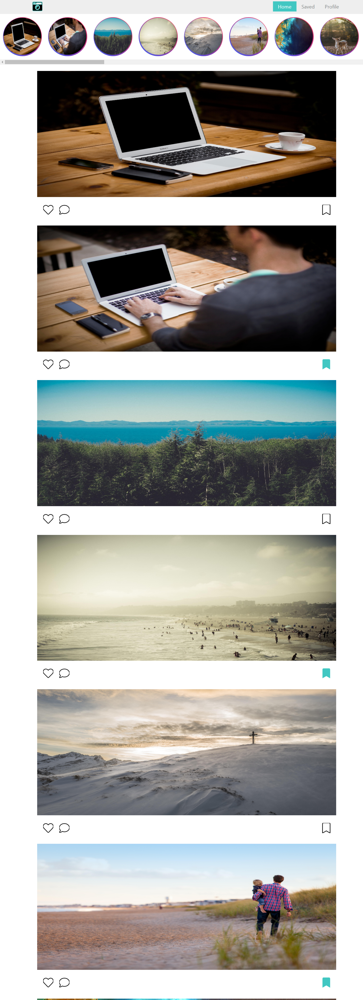
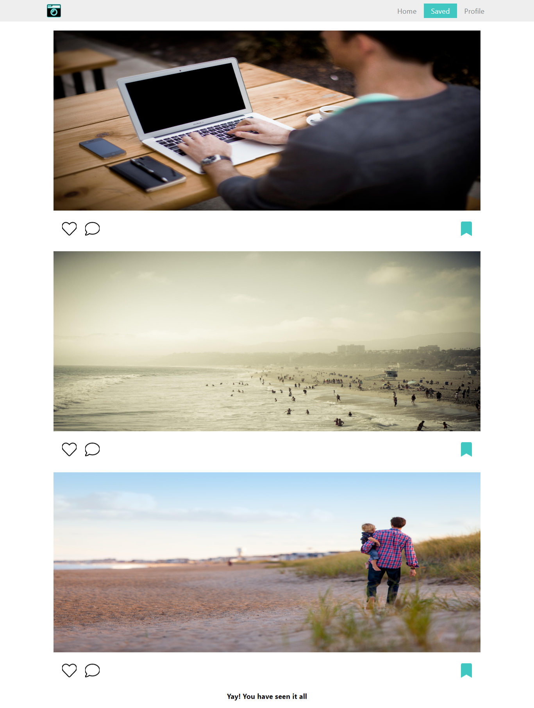
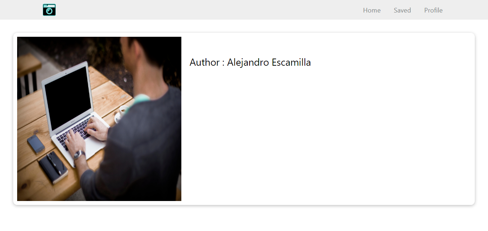

# 1) MANDATORY PAGES IMPLEMENTED

* /home -- vertically scrollable list of images with save toddle button used redux global state to handle saving functionality
* /saved-images -- saved images in a vertical scrollable list
* /image/<image-id> --clicking on image redirect to image/ id of the image clicked

# 2) OPTIONAL PAGES IMPLEMENTED

* horizontally scrollable list of round images
* saved images are retained even on page reload

# 3) MOBILE VIEW

# 4) DESKTOP VIEW

